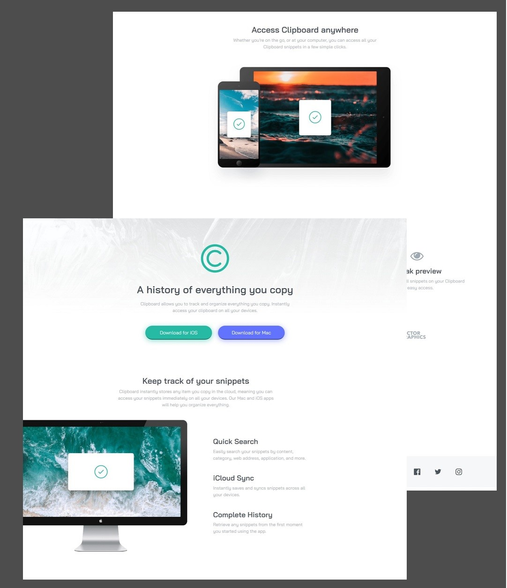

# Frontend Mentor - Clipboard landing page solution

This is a solution to the [Clipboard landing page challenge on Frontend Mentor](https://www.frontendmentor.io/challenges/clipboard-landing-page-5cc9bccd6c4c91111378ecb9). Frontend Mentor challenges help you improve your coding skills by building realistic projects.

## Table of contents

- [Overview](#overview)
  - [The challenge](#the-challenge)
  - [Screenshot](#screenshot)
  - [Links](#links)
- [My process](#my-process)
  - [Built with](#built-with)
  - [What I learned](#what-i-learned)
  - [Continued development](#continued-development)
- [Author](#author)

**Note: Delete this note and update the table of contents based on what sections you keep.**

## Overview

### The challenge

Users should be able to:

- View the optimal layout for the site depending on their device's screen size
- See hover states for all interactive elements on the page

### Screenshot

Challenge design

My solution

### Links

- [Frontend Mentor Solution](https://www.frontendmentor.io/solutions/clipboard-landing-page-VfXpGpjGfi)
- [Live Site](https://eter-ns.github.io/Clipboard-landing-page/)

## My process

### Built with

- Semantic HTML5 markup
- CSS custom properties
- Flexbox
- CSS Grid
- Mobile-first workflow

### What I learned

Nothing technical. I wanted to train my planning on how to play with the design here and don't make so much bad decisions from the start.

### Continued development

I want to focus on how to do as less media queries as possible (as Kevin Powell said 😎).

## Author

<!-- - Website - [Norbert Sosnowski](https://www.your-site.com) -->

- Frontend Mentor - [@Eter-NS](https://www.frontendmentor.io/profile/Eter-NS)
- Twitter - [@eter_ns](https://www.twitter.com/eter_ns)
- Linkedin - [Norbert Sosnowski](https://www.linkedin.com/in/norbert-sosnowski-629535197/)
